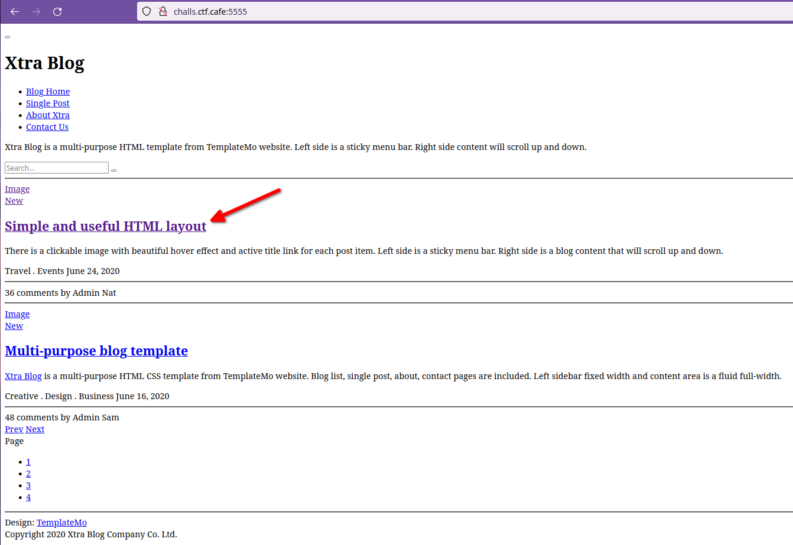
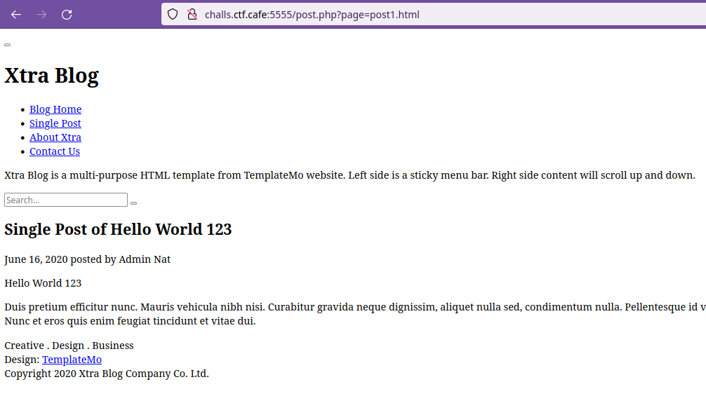
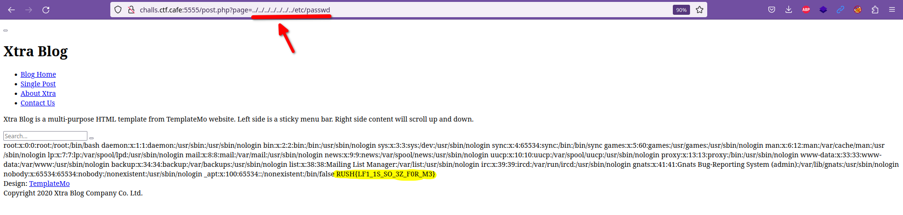

# Blog
## Description
Solves: 33  Easy

Hey what do you think about my blog?

http://challs.ctf.cafe:5555/

## Hint
where are password's stored?

## Analysis
If we go to the web page we can see a simple HTML web with no css, they were having struggles to make it work with it.

I just decided to click on "Simple and useful HTML layout" an redirect me to this page:

## Explotation
If we take a look to the URL, we can see that the page parameter is doing reference to "post1.html", which looks like a normal, file, so I imediately realised that this could be a Local File Inclusion (LFI), so I tried...

And gg wp, here was the flag.

RUSH{LF1_1S_SO_3Z_F0R_M3}
